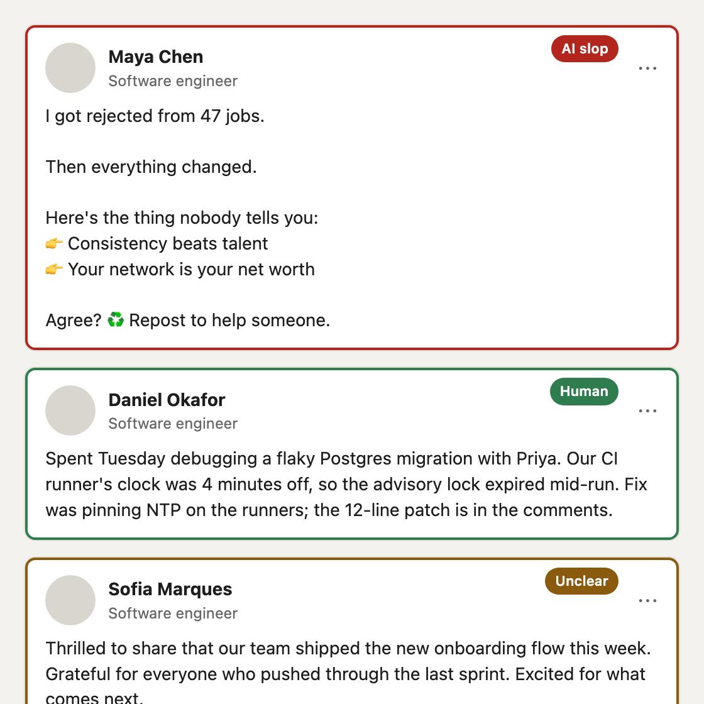
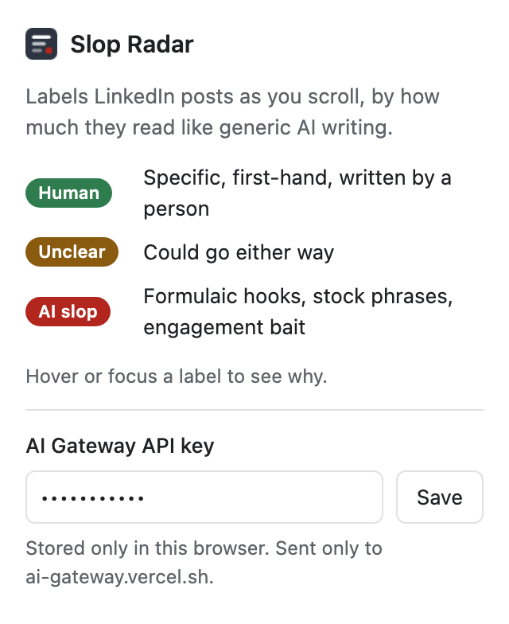

<div align="center">


# Slop Radar

**See which LinkedIn posts read like AI slop before you read them.** Each post gets a quiet label as it scrolls into view: human, unclear or AI slop, with the reasons one hover away.

[](https://github.com/dgr8akki/slop-radar/actions/workflows/ci.yml)
[](LICENSE)


<picture>
  <source media="(prefers-color-scheme: dark)" srcset="docs/feed-dark.png" />
  
</picture>

</div>

## Features

- **Labels as you scroll.** Posts are rated when they're 40% on screen, so there's nothing to click.
- **Explains itself.** Hover or focus a label to see the percentages and the signals behind them: generic hook, one-line "broetry", stock AI phrases, engagement bait, or concrete first-hand details.
- **Honest about doubt.** A post is only called human or slop when one side holds 60% of the probability. Everything else is "Unclear".
- **Cheap and fast.** One Jev call per post, cached, so scrolling back costs nothing. Jev costs $0.042 per million input tokens.
- **Minimal permissions.** Runs only on linkedin.com and talks only to Vercel AI Gateway.

## How it works

Slop Radar is built on [Jev](https://typesafe.ai), TypeSafe's System One model. Jev doesn't generate text: it answers typed questions with probabilities.

For each post, one request asks six questions at once:

| Question                                                        | Type   |
| --------------------------------------------------------------- | ------ |
| How much does this read like AI slop? (five levels)             | Score  |
| Does it open with a generic hook?                               | Yes/no |
| Is it one-sentence-per-line "broetry" or emoji bullets?         | Yes/no |
| Does it use stock AI phrasing?                                  | Yes/no |
| Does it end with engagement bait?                               | Yes/no |
| Does it include first-hand details a template couldn't produce? | Yes/no |

The verdict comes from **summing each side of the five-level scale**, not from Jev's single-level confidence. A post that's 36% "clearly human" and 46% "mostly human" is 82% human, even though no single level is confident.

> [!IMPORTANT]
> Slop Radar judges **writing style**, not authorship. No tool can prove a post was written by AI, and a person writing in LinkedIn's house style will be labelled slop. Treat the labels as a reading aid.

## Install

Slop Radar isn't on the Chrome Web Store yet. To install from source:

1. Download the latest `slop-radar-x.y.z.zip` from [Releases](https://github.com/dgr8akki/slop-radar/releases) and unzip it, or clone this repo.
2. Open `chrome://extensions` and turn on **Developer mode**.
3. Click **Load unpacked** and select the unzipped folder (or `src/` in a clone).
4. Click the Slop Radar icon, paste your [AI Gateway API key](https://vercel.com/docs/ai-gateway/authentication-and-byok/api-keys) and select **Save**. The popup checks the key.
5. Reload LinkedIn and scroll.

Set a [spend limit](https://vercel.com/docs/ai-gateway/observability-and-spend/budgets) on the key you use. A heavy scrolling session costs well under a cent.

<picture>
  <source media="(prefers-color-scheme: dark)" srcset="docs/popup-dark.png" />
  
</picture>

## Privacy and permissions

| Permission                           | Why                                                      |
| ------------------------------------ | -------------------------------------------------------- |
| Content script on `www.linkedin.com` | Reads the text of posts in your feed and adds the labels |
| `https://ai-gateway.vercel.sh/*`     | Sends post text to Jev for rating                        |
| `storage`                            | Keeps your API key and cached ratings in this browser    |

Only the visible text of posts is sent, to Vercel AI Gateway, which forwards it to TypeSafe. Author names, profiles, comments and your own activity are not sent. See [PRIVACY.md](PRIVACY.md).

## Development

Requires Node.js 22 or later.

```sh
npm install
npm run check      # lint + format check + unit tests
npm run eval       # live evaluation against Jev (needs AI_GATEWAY_API_KEY in .env)
npm run package    # builds dist/slop-radar-<version>.zip for the Chrome Web Store
```

| Script            | Purpose                                                     |
| ----------------- | ----------------------------------------------------------- |
| `npm test`        | Unit tests with `node:test`; Jev and Chrome are faked       |
| `npm run lint`    | ESLint                                                      |
| `npm run format`  | Prettier                                                    |
| `npm run eval`    | Real Jev ratings of sample posts; waits out rate limits     |
| `npm run icons`   | Renders `assets/icon.svg` to PNGs with headless Chrome      |
| `npm run package` | Zips `src/` for upload and checks the version numbers match |

### Project structure

```
src/
├── manifest.json
├── background.js          Service worker: rates post text, keeps the key and cache
├── content/               LinkedIn content script and label styles
├── popup/                 Legend and API key settings
└── lib/
    ├── jev.js             Jev client: retries, rate-limit pauses, clear errors
    └── rating.js          Questions, verdict rules, cache, one-at-a-time rater
test/                      Unit tests (jsdom feed for the content script)
evals/                     Live evaluation against Jev
```

### Tests

- **Unit tests** cover the verdict rules, the cache and its size limit, the rater's queueing and rate-limit handling, and the content script running in a jsdom feed (labelling, skipping short posts, re-rating expanded posts, error labels).
- **The live evaluation** rates five hand-written posts with the real model and checks both the verdicts and the key signals.

## Troubleshooting

| Problem                   | Fix                                                                                                                  |
| ------------------------- | -------------------------------------------------------------------------------------------------------------------- |
| No labels at all          | Reload LinkedIn after saving your key. If still nothing, LinkedIn may have changed its markup: please open an issue. |
| Labels say "Not rated"    | Hover the label for the reason. Usually a missing or rejected key.                                                   |
| "Jev is busy" on hover    | TypeSafe is overloaded. Slop Radar waits and retries on its own; scroll on and come back.                            |
| Short posts have no label | Posts under 80 characters are too short to judge.                                                                    |

## Limitations

- Rates the text visible before "… more". Expanding a post triggers a new rating once the text grows by 30%.
- Relies on two LinkedIn markup hooks (`componentkey="update-card…"` and `data-testid="expandable-text-box"`). If LinkedIn changes them, labels stop appearing until an update.
- English-language prompts; posts in other languages are rated less reliably.

## License

[MIT](LICENSE) © 2026 Aakash Pahuja
