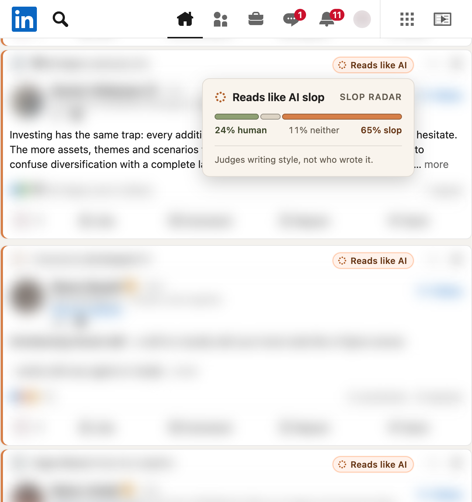
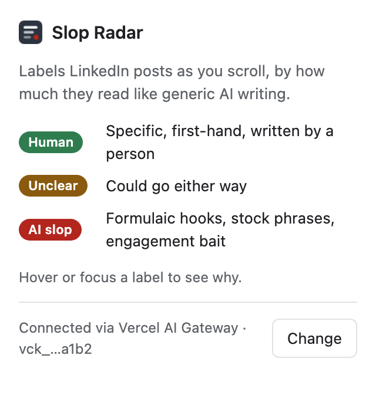
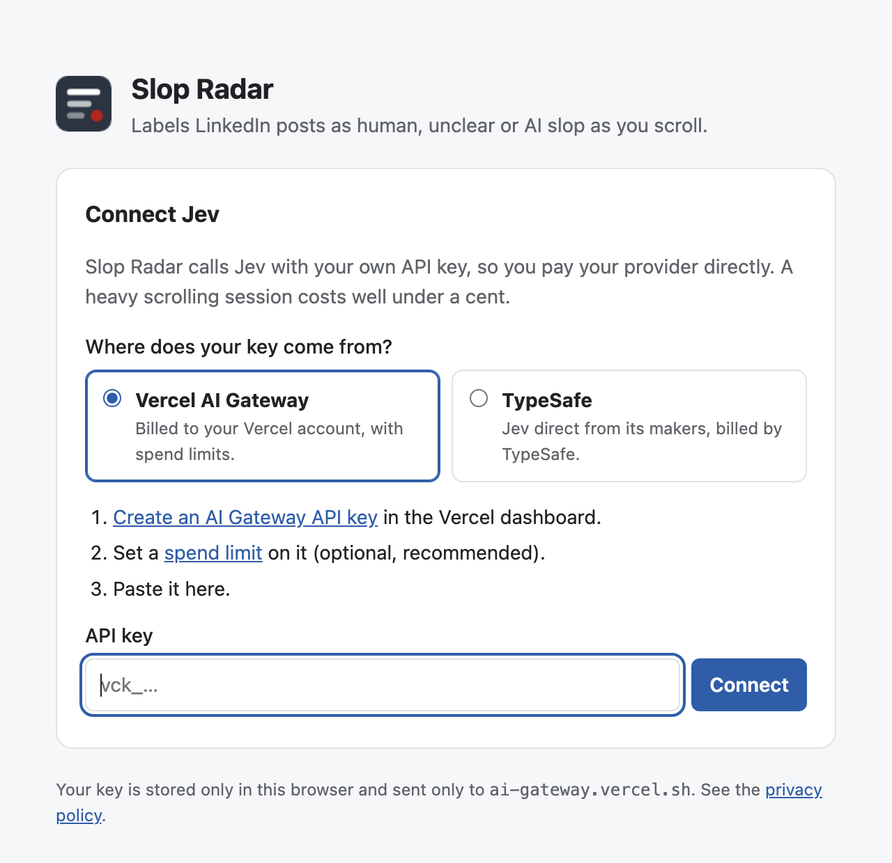

<div align="center">


# Slop Radar

</div>

Slop Radar is an AI slop detector for LinkedIn: a Chrome extension that tags each post in your feed Human, Unclear or Reads like AI as it scrolls into view, and shows the signals behind the call when you hover or tap the tag. It judges writing style, not who wrote it.

Not affiliated with or endorsed by LinkedIn.

[](https://github.com/dgr8akki/slop-radar/actions/workflows/ci.yml)

<picture>
  <source media="(prefers-color-scheme: dark)" srcset="docs/feed-dark.png" />
  
</picture>

## What the tags mean

Posts get rated once about 40% of them is on screen. You don't click anything. Hover a tag, or tap it, and you get a meter (human on the left, slop on the right) plus the signals that moved it: a generic hook, one-sentence-per-line "broetry", stock phrases, engagement bait, or, on the other side, concrete first-hand detail.

The tags are small and cream so they don't fight LinkedIn's own UI, and each state has its own glyph, so colour is never the only cue. Human and Reads like AI also get a thin coloured rule down the left of the card. The dark theme is read off the card itself, because LinkedIn ignores the system setting.

It says "Unclear" a lot on purpose. A verdict needs 60% of the probability on one side.

One request per post, cached, so scrolling back up is free. Posts under 80 characters are skipped as too short to judge, and a post is rated again when "…more" grows its text by 30%.

<picture>
  <source media="(prefers-color-scheme: dark)" srcset="docs/popup-dark.png" />
  
</picture>

## How a post gets its tag

Slop Radar asks [Jev](https://typesafe.ai), TypeSafe's System One model, six fixed questions about each post in one request. Jev doesn't write anything back; it answers each question with probabilities.

| Question                                                        | Type   |
| --------------------------------------------------------------- | ------ |
| How much does this read like AI slop? (five levels)             | Score  |
| Does it open with a generic hook?                               | Yes/no |
| Is it one-sentence-per-line "broetry" or emoji bullets?         | Yes/no |
| Does it use stock AI phrasing?                                  | Yes/no |
| Does it end with engagement bait?                               | Yes/no |
| Does it include first-hand details a template couldn't produce? | Yes/no |

The verdict adds up the two human levels against the two slop levels. A post that's 36% "clearly human" and 46% "mostly human" is 82% human, even though the model isn't confident about either level alone.

It judges style, not authorship. Nothing can prove a post was written by a model, and a person who writes in LinkedIn house style will get tagged too. Treat it as a hint.

## Install

Until the store listing is live, install from Releases. You need Chrome 140 or newer.

1. Grab `slop-radar-x.y.z.zip` from [Releases](https://github.com/dgr8akki/slop-radar/releases) and unzip it. A clone works as well; you'll load its `src/` folder.
2. In `chrome://extensions`, flip on Developer mode, click Load unpacked, then select the folder.
3. Settings open by themselves. Choose a provider and paste a [TypeSafe API key](https://console.typesafe.ai/keys) or a [Vercel AI Gateway API key](https://vercel.com/docs/ai-gateway/authentication-and-byok/api-keys). Connect makes one test call before keeping anything, so a mistyped key never gets stored.
4. Open your LinkedIn feed and scroll. Tags appear as posts come into view.

Every rating runs on your key, so the bill is yours, not mine. At [TypeSafe's](https://typesafe.ai) current prices an evening on the feed comes to under a cent. If you go through Vercel, give the key a [budget](https://vercel.com/docs/ai-gateway/observability-and-spend/budgets) all the same.

<picture>
  <source media="(prefers-color-scheme: dark)" srcset="docs/options-dark.png" />
  
</picture>

## When a tag is wrong or missing

| Problem                                                    | What to do                                                                                              |
| ---------------------------------------------------------- | ------------------------------------------------------------------------------------------------------- |
| A "Slop Radar isn't connected" card at the top of the feed | Press Connect Jev on it; the settings page opens. If it says the key was rejected, paste a fresh one.   |
| No tags and no card                                        | LinkedIn may have changed its markup. Please open an issue with the date and what the feed looked like. |
| A tag says "Not rated"                                     | Hover it for the reason. It is asked about again when it scrolls back into view.                        |
| A Checking tag says the provider is busy                   | The provider is rate-limiting. The tag says when it will ask again; carry on scrolling.                 |
| Short posts have no tag                                    | Posts under 80 characters are too short to judge.                                                       |

Rates the text visible before "…more"; expanding a post triggers a new rating once the text grows by 30%. Relies on two LinkedIn markup hooks (`componentkey="update-card…"` and `data-testid="expandable-text-box"`), so if LinkedIn changes them, tags stop appearing until an update. The questions are written in English, and posts in other languages are rated less reliably.

## The four permissions

The manifest asks for four things. A content script on `www.linkedin.com` reads post text in your feed and draws the tags. Two API hosts, `https://api.typesafe.ai/*` and `https://ai-gateway.vercel.sh/*`, are there because you choose between them; post text only ever goes to the one you picked. And `storage` holds your API key and the cached ratings in this browser.

The content script matches all of `www.linkedin.com` rather than `/feed/` alone on purpose: LinkedIn is a single-page app, and a script tied to one path would not be injected when you reach the feed by clicking around inside the site. It only looks for posts on feed-like routes and does nothing on messaging, jobs or profiles.

The only thing that leaves your browser is the visible text of feed posts, sent with your key to the provider you picked. The author's name, profile, comments and your own activity stay put. The key is kept in extension storage the LinkedIn page can't read, which is why Chrome 140 is the floor. The whole of [PRIVACY.md](PRIVACY.md) is short.

## Development

Node.js 22 or later.

```sh
npm ci
npm run check      # ESLint, Prettier and node:test; keep it green before committing
npm run eval       # sample posts against the real model, with a key in .env (TYPESAFE_API_KEY, else AI_GATEWAY_API_KEY)
npm run package    # dist/slop-radar-<version>.zip for the Chrome Web Store
```

`npm run icons` re-renders `assets/icon.svg` to PNGs with headless Chrome. Some files under `src/lib`, `src/options` and `test` are copies from [jev-shared](https://github.com/dgr8akki/jev-shared); `SHARED.md` lists them and `node scripts/sync-shared.js --check` catches drift.

```
src/
├── manifest.json
├── background.js          Service worker: rates post text, keeps the key and the cache
├── content/               LinkedIn content script and tag styles
├── popup/                 Legend and the connection line
├── options/               Settings: where the key goes in, gets tested and comes out
├── ui/                    Theme and bundled fonts (Figtree, Caprasimo; OFL) for popup and settings
└── lib/
    ├── connection.js      "Connected via …" line; opens settings
    ├── jev.js             Shared Jev client (timeouts, retries, 429 pauses)
    └── rating.js          Questions, verdict rules, cache, one-at-a-time rater
test/                      Unit tests; the content script runs in a jsdom feed
test/live/                 Check against the real model, run by hand
```

There are unit tests for the verdict rules, the cache, the rater's queue and rate-limit handling, the service worker's message routing, the settings and popup pages, and the content script in a jsdom feed (tagging, skipping short posts, re-rating expanded posts, the connect card, error tags). The live check rates a handful of sample posts with the real model and compares verdicts and signals.

## Siblings

I built three other extensions on Jev, and they want your own key too. [Jev Voice](https://github.com/dgr8akki/jev-voice) is for driving Chrome by voice. [Recipe Mode](https://github.com/dgr8akki/recipe-mode) reads a recipe aloud while your hands are floury. [Intent Guard](https://github.com/dgr8akki/intent-guard) notices when you've wandered off the task you set yourself.

## License

[MIT](LICENSE) © 2026 Aakash Pahuja
